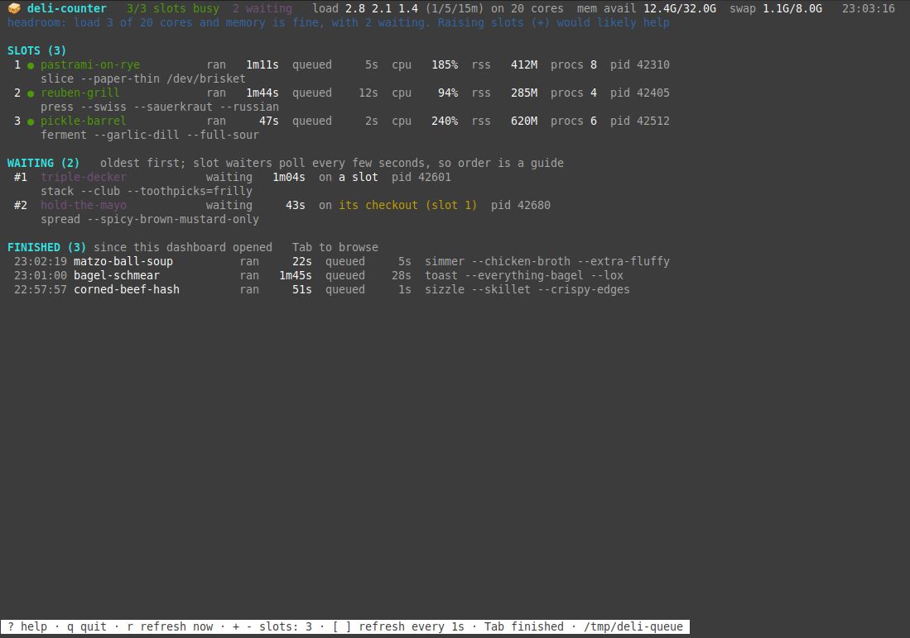

# 🥪 deli-counter

I run a lot of coding agents on one machine. They all start test runs and builds at the same
time, the machine runs out of CPU and memory, and half the runs get killed partway through.

This is a small fix for that:

- `deli` makes heavy commands take a ticket and wait for a free slot at the counter, so only a few run at once.
- `deli-counter` is a terminal dashboard showing what's running, what's waiting, and how loaded
  the machine is.



Works on Linux and macOS. It needs bash, `flock` and python3 (for the dashboard only). Linux
has `flock` already; on macOS the installer offers to `brew install flock` for you. Nothing
else to install: the dashboard only uses Python's standard library.

On Windows, use it inside [WSL](https://learn.microsoft.com/windows/wsl/install). A native
Windows version would mean rewriting both tools as a single compiled program, which I'll do if
people want it, so [open an issue](https://github.com/mstelz/deli-counter/issues) if that's you.

## Install

```bash
curl -fsSL https://raw.githubusercontent.com/mstelz/deli-counter/main/install.sh | bash
```

This clones the repo to `~/.local/share/deli-counter` and symlinks `deli` and `deli-counter`
into `~/.local/bin`. It asks before installing anything else (flock on macOS, and the Claude
Code skill if you use Claude Code).
Add `-s -- -y` after `bash` to say yes to everything. Run the same command again to update.

Or from a clone:

```bash
git clone https://github.com/mstelz/deli-counter.git
cd deli-counter && ./install.sh
```

To remove it: `./install.sh --uninstall` (or `~/.local/share/deli-counter/install.sh --uninstall`).

## deli

Put it in front of anything heavy:

```bash
deli -- npm test
deli --label api-build -- cargo build --release
```

It waits until it's this command's turn at the counter, runs it, and exits with the command's exit code. Other
commands:

```bash
deli --status     # what's running and what's waiting
deli --slots      # how many things can run at once (default 2)
deli --slots 3    # change it for the whole machine
deli              # running with no arguments opens the deli-counter dashboard
```

A few details:

- Two runs in the same git checkout never overlap, even if slots are free. Agents in one
  checkout often share a test database or build folder.
- The locks go away when the process dies, even if it's killed, so a crashed run never jams
  the queue.
- Changing the slot count takes effect within a few seconds. Lowering it doesn't stop anything
  already running; those runs just finish.

## Measuring a command: deli inspect

Not everything needs a slot. A one-file test on a 32-core machine can finish while it would
still be waiting in line. `deli inspect` measures a command on this machine, so deli can tell:

```bash
deli inspect -- npm test            # runs in the queue as usual, then prints what it used
deli inspect --show -- npm test     # what's saved for it, and its class here
deli inspect --list                 # everything measured on this machine
deli inspect --forget -- npm test
```

It records wall time, CPU time, peak cores and peak memory of the whole process tree, and puts
the command in a class for this machine:

| class | means | limits (share of this machine) |
| --- | --- | --- |
| light | runs without waiting for a slot | under 15 s CPU, under 10% of cores on average (at least 1), peaks under 25% of cores (at least 2), under 5% of memory |
| medium | queue it | anything between |
| heavy | queue it | peaks at 50% of cores or more (at least 2), or 25% of memory or more |

Once a command is light, `deli -- <command>` from the same folder runs it straight away. It
still takes the checkout lock, so it never overlaps another run in the same checkout. Those runs
are measured too, so a test suite that grows past light goes back into the queue by itself. Set
`DELI_FASTPATH=0` to queue everything as before.

How profiles are kept:

- **Per machine.** Profiles live in `~/.local/state/deli/profiles-<machine>.json`, where
  `<machine>` is a short hash of the machine id (`/etc/machine-id`, or the hardware UUID on
  macOS). A home folder shared between machines never mixes their numbers.
- **Judged against this machine's size.** The file keeps raw numbers, not a class. The class is
  worked out each time from the current core count and memory. So 6 GB of peak memory is heavy
  on a 16 GB laptop but under the light limit on a 128 GB workstation, and a hardware upgrade
  reclassifies everything with no re-measuring.
- **Keyed by folder and exact arguments.** `npm test` at the repo root and in `packages/core`
  are separate profiles, and so are `npm test` and `npm test -- foo.test.ts`.
- **Worst of the last 5 good runs.** A warm-cache build can look light next to a cold one, so
  one heavy run is enough to keep a command queued. Failed runs aren't saved: a run that stops
  early looks lighter than it is.

`deli inspect` needs python3. Without it, deli queues everything as it always has.

Environment variables, if you need them: `DELI_QUEUE_DIR` (where the queue keeps its files,
default `/tmp/deli-queue`), `DELI_QUEUE_SLOTS` (starting slot count if you never set one),
`DELI_QUEUE_POLL_SECONDS` (how often waiting runs check for a slot, default 5), `DELI_STATE_DIR`
(where profiles are kept, default `~/.local/state/deli`), `DELI_FASTPATH=0` (never skip the
slot).

## Getting agents to use it

Agents only use the queue if you tell them to. The Claude Code skill does this for Claude.
For other agents, or to be safe, add something like this to your `CLAUDE.md`, `AGENTS.md` or
`GEMINI.md`:

```markdown
# Heavy commands go through the deli
This machine runs many agents at once and kills overloaded work. Run anything CPU- or
memory-heavy (tests, typecheck, lint, builds, docker, headless browsers) as
`deli -- <command>`. It waits for a free counter slot, so give it a long timeout or run it in the
background. A run that dies with no failed test is load: re-run it through the deli before debugging.
```

## deli-counter

```bash
deli-counter           # full screen, updates every second
deli-counter --once    # print a snapshot and exit
```

The top line shows slots in use, how many runs are waiting, load, and free memory. The line
under it tells you in plain words whether the machine has room for more slots or is already
overloaded. Press `?` in the dashboard for what every number means.

Keys:

| key | does |
| --- | --- |
| `+` / `-` | more or fewer slots (for the whole machine) |
| `Tab` | move into the finished list; arrows to scroll, `Enter` for details, `Esc` to leave |
| `[` / `]` | update the screen faster or slower |
| `r` | update now |
| `?` | help |
| `q` | quit |

The finished list only has runs that ended while the dashboard was open, and it can miss runs
shorter than a second or so.

## How it works

Everything is plain files in `/tmp/deli-queue`. Each slot is a lock file (`slot-1.lock`, ...)
that a run holds with `flock` while its command runs, plus an info file saying who has it.
Waiting runs write a `wait-<pid>.info` file and check for a free slot every few seconds. The
slot count is in a file called `slots`. The dashboard reads those files plus process info
(`/proc` on Linux, `ps` and `lsof` on macOS), and the only thing it ever writes is the `slots`
file.
