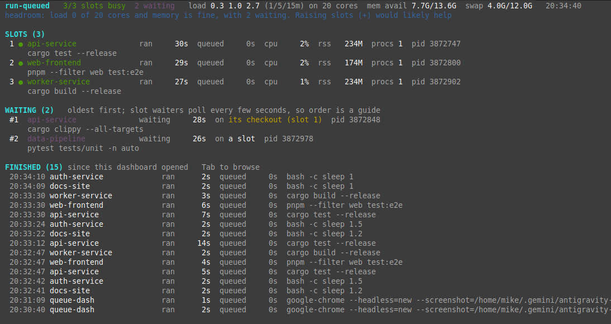

# run-queued

I run a lot of coding agents on one machine. They all start test runs and builds at the same
time, the machine runs out of CPU and memory, and half the runs get killed partway through.

This is a small fix for that:

- `run-queued` makes heavy commands wait for a free slot, so only a few run at once.
- `queue-dash` is a terminal dashboard showing what's running, what's waiting, and how loaded
  the machine is.



Works on Linux and macOS. It needs bash, `flock` and python3 (for the dashboard only). Linux
has `flock` already; on macOS the installer offers to `brew install flock` for you. Nothing
else to install: the dashboard only uses Python's standard library.

On Windows, use it inside [WSL](https://learn.microsoft.com/windows/wsl/install). A native
Windows version would mean rewriting both tools as a single compiled program, which I'll do if
people want it, so [open an issue](https://github.com/mstelz/run-queued/issues) if that's you.

## Install

```bash
curl -fsSL https://raw.githubusercontent.com/mstelz/run-queued/main/install.sh | bash
```

This clones the repo to `~/.local/share/run-queued` and symlinks `run-queued` and `queue-dash`
into `~/.local/bin`. It asks before installing anything else (flock on macOS, and the Claude
Code skill if you use Claude Code). Add `-s -- -y` after `bash` to say yes to everything. Run
the same command again to update.

Or from a clone:

```bash
git clone https://github.com/mstelz/run-queued.git
cd run-queued && ./install.sh
```

To remove it: `./install.sh --uninstall` (or `~/.local/share/run-queued/install.sh --uninstall`).

## run-queued

Put it in front of anything heavy:

```bash
run-queued -- npm test
run-queued --label api-build -- cargo build --release
```

It waits until it's this command's turn, runs it, and exits with the command's exit code. Other
commands:

```bash
run-queued --status     # what's running and what's waiting
run-queued --slots      # how many things can run at once (default 2)
run-queued --slots 3    # change it for the whole machine
```

A few details:

- Two runs in the same git checkout never overlap, even if slots are free. Agents in one
  checkout often share a test database or build folder.
- The locks go away when the process dies, even if it's killed, so a crashed run never jams
  the queue.
- Changing the slot count takes effect within a few seconds. Lowering it doesn't stop anything
  already running; those runs just finish.

Environment variables, if you need them: `AGENT_QUEUE_DIR` (where the queue keeps its files,
default `/tmp/agent-queue`), `AGENT_QUEUE_SLOTS` (starting slot count if you never set one),
`AGENT_QUEUE_POLL_SECONDS` (how often waiting runs check for a slot, default 5).

## Getting agents to use it

Agents only use the queue if you tell them to. The Claude Code skill does this for Claude.
For other agents, or to be safe, add something like this to your `CLAUDE.md`, `AGENTS.md` or
`GEMINI.md`:

```markdown
# Heavy commands go through the work queue
This machine runs many agents at once and kills overloaded work. Run anything CPU- or
memory-heavy (tests, typecheck, lint, builds, docker, headless browsers) as
`run-queued -- <command>`. It waits for a free slot, so give it a long timeout or run it in the
background. A run that dies with no failed test is load: re-run it queued before debugging.
```

## queue-dash

```bash
queue-dash           # full screen, updates every second
queue-dash --once    # print a snapshot and exit
```

The top line shows slots in use, how many runs are waiting, load, and free memory. The line
under it tells you in plain words whether the machine has room for more slots or is already
overloaded. Press `?` in the dashboard for what every number means.

Keys:

| key | does |
| --- | --- |
| `+` / `-` | more or fewer slots (for the whole machine) |
| `Tab` | move into the finished list; arrows to scroll, `Enter` for details, `Esc` to leave |
| `[` / `]` | update the screen faster or slower |
| `r` | update now |
| `?` | help |
| `q` | quit |

The finished list only has runs that ended while the dashboard was open, and it can miss runs
shorter than a second or so.

## How it works

Everything is plain files in `/tmp/agent-queue`. Each slot is a lock file (`slot-1.lock`, ...)
that a run holds with `flock` while its command runs, plus an info file saying who has it.
Waiting runs write a `wait-<pid>.info` file and check for a free slot every few seconds. The
slot count is in a file called `slots`. The dashboard reads those files plus process info
(`/proc` on Linux, `ps` and `lsof` on macOS), and the only thing it ever writes is the `slots`
file.
